> **DEPRECATED:** This document has been superseded by `KOSMOS_ROSETTA_STONE.md`.
> Use the Rosetta Stone for current, verified onboarding information.
> This file is retained for historical reference only.

---

# KOSMOS: AI Coding Assistant Onboarding (DEPRECATED)

> **Purpose:** Enable a fresh Claude instance to work effectively in this codebase
> **Prepared by:** repo_xray agent
> **Codebase:** 793 files, ~2.4M tokens
> **This document:** ~15K tokens

---

## Quick Orientation

**KOSMOS** is an autonomous AI research platform that conducts end-to-end scientific research using Claude. It generates hypotheses, designs computational experiments, executes them in sandboxed environments, analyzes results, and iteratively refines understanding. Think of it as "AI scientist-in-a-box" — you provide a research question, KOSMOS orchestrates specialized agents to investigate it autonomously.

**Tech stack:** Python 3.11+, Pydantic for data models, SQLAlchemy for persistence, Neo4j for knowledge graphs, Anthropic Claude (primary LLM), multi-provider support (OpenAI, LiteLLM). Architecture is agent-based with async message passing.

**Key insight:** This is NOT a simple LLM wrapper. It's a sophisticated multi-agent system with state machines, workflow orchestration, knowledge management, and scientific rigor validation built in.

---

## Architecture

```mermaid
graph TD
    subgraph ORCHESTRATION
        kosmos_core_workflow[workflow]
        kosmos_workflow_research_loop[research_loop]
        kosmos_world_model_factory[factory]
        kosmos_agents_literature_analyzer[literature_analyzer]
        kosmos_core_cache_manager[cache_manager]
        kosmos_hypothesis_novelty_checker[novelty_checker]
        kosmos_agents_experiment_designer[experiment_designer]
        kosmos_core_feedback[feedback]
        kosmos_core_memory[memory]
    end
    subgraph CORE
        kosmos_agents_research_director[research_director]
        kosmos_knowledge_vector_db[vector_db]
        kosmos_execution_executor[executor]
        kosmos_knowledge_graph[graph]
        kosmos_safety_code_validator[code_validator]
        kosmos_core_providers_anthropic[anthropic]
        kosmos_agents_hypothesis_generator[hypothesis_generator]
        kosmos_cli_main[main]
        kosmos_core_async_llm[async_llm]
        kosmos_literature_unified_search[unified_search]
    end
    subgraph FOUNDATION
        kosmos_core_logging[logging]
        kosmos_config[config]
        kosmos_models_hypothesis[hypothesis]
        kosmos_literature_base_client[base_client]
        kosmos_models_experiment[experiment]
        kosmos_core_llm[llm]
        kosmos[kosmos]
        kosmos_models_result[result]
        kosmos_world_model_models[models]
    end
    kosmos_core_workflow --> kosmos_core_logging
    kosmos_core_workflow --> kosmos_config
    kosmos_workflow_research_loop --> kosmos_core_logging
    kosmos_world_model_factory --> kosmos_core_logging
    kosmos_world_model_factory --> kosmos_config
    kosmos_agents_literature_analyzer --> kosmos_core_logging
    kosmos_agents_literature_analyzer --> kosmos_core_llm
    kosmos_core_cache_manager --> kosmos_core_logging
    kosmos_core_cache_manager --> kosmos_config
    kosmos_core_llm <-.-> kosmos_core_providers_anthropic
    kosmos_world_model <-.-> kosmos_world_model_artifacts
```



### Layer Summary

| Layer | Purpose | Key Modules |
|-------|---------|-------------|
| **Orchestration** | Research workflow management, agent coordination | `workflow.py` (state machine), `research_loop.py`, agent orchestrators |
| **Core** | Specialized agents, business logic, LLM clients | `research_director.py` (master agent), `hypothesis_generator.py`, `experiment_designer.py`, `data_analyst.py`, `executor.py` |
| **Foundation** | Data models, configuration, logging, shared utilities | `hypothesis.py`, `experiment.py`, `result.py`, `config.py`, `logging.py` |

**Critical insight:** The foundation layer (logging, config, data models) is imported by 136+ modules. Changes here have massive ripple effects.

---

## Critical Components

### ResearchDirectorAgent

**File:** `kosmos/agents/research_director.py` (~21K tokens — USE SKELETON ONLY)
**Why it matters:** Master orchestrator that coordinates all other agents through async message passing

**Key pattern:**
```python
class ResearchDirectorAgent(BaseAgent):
    def __init__(self, research_question, domain, ...):
        self.research_question = research_question
        self.domain = domain
        self.research_plan = ResearchPlan(...)  # Tracks state
        self.workflow = ResearchWorkflow(...)   # State machine
        self.max_iterations = ...
        # Loads 20+ other agents dynamically
    
    async def execute(self):
        # Main research loop (async)
        # Iterates through states: GENERATING_HYPOTHESES -> DESIGNING_EXPERIMENTS
        # -> EXECUTING -> ANALYZING -> REFINING -> (repeat or CONVERGED)
```

**What to know:**
- **State machine driven:** Uses `ResearchWorkflow` from `core/workflow.py` to manage research cycle states
- **Message-based coordination:** Communicates with specialized agents via `AgentMessage` objects (not direct calls)
- **Error recovery:** Has exponential backoff and max consecutive error limits
- **Infinite loop protection:** Hard cap at 50 actions/iteration (Issue #51)
- **High churn (risk: 0.82):** Changed 17 times, 13 hotfixes — handle with care

### Hypothesis & Experiment Data Models

**Files:** `kosmos/models/hypothesis.py`, `kosmos/models/experiment.py`
**Why they matter:** Core domain models that define data flowing through the entire system

**Key classes:**
```python
# hypothesis.py
class Hypothesis(BaseModel):
    statement: str              # Testable hypothesis statement
    rationale: str              # Scientific justification
    domain: str                 # biology, physics, ML, etc.
    testability_score: float    # 0.0-1.0
    novelty_score: float        # 0.0-1.0
    suggested_experiment_types: List[ExperimentType]
    # Evolution tracking (Phase 7 - iterative refinement)
    parent_hypothesis_id: Optional[str]
    generation: int             # 1 = original, 2+ = refined
    
    # Validators ensure predictive statements, not questions
    @field_validator('statement')
    def validate_statement(cls, v): ...

# experiment.py
class ExperimentProtocol(BaseModel):
    hypothesis_id: str
    experiment_type: ExperimentType  # COMPUTATIONAL, DATA_ANALYSIS, LITERATURE_SYNTHESIS
    steps: List[ProtocolStep]        # Ordered execution steps
    variables: Dict[str, Variable]   # Independent, dependent, control
    control_groups: List[ControlGroup]
    statistical_tests: List[StatisticalTestSpec]
    resource_requirements: ResourceRequirements  # Compute, memory, cost estimates
    rigor_score: float              # Scientific rigor validation
```

**What to know:**
- **Pydantic V2:** Uses `BaseModel` with validators — field validation is strict
- **Rich domain logic:** Not just data containers — have helper methods like `is_testable()`, `get_best_hypothesis()`
- **Evolution tracking:** Hypotheses can spawn refined versions (generation counter)
- **Imported by 46+ modules:** Changes to these models cascade throughout the system

### Research Workflow State Machine

**File:** `kosmos/core/workflow.py` (417 lines)
**Why it matters:** Defines the research cycle that KOSMOS executes

```python
class WorkflowState(str, Enum):
    INITIALIZING = "initializing"
    GENERATING_HYPOTHESES = "generating_hypotheses"
    DESIGNING_EXPERIMENTS = "designing_experiments"
    EXECUTING = "executing"
    ANALYZING = "analyzing"
    REFINING = "refining"
    CONVERGED = "converged"
    PAUSED = "paused"
    ERROR = "error"

class ResearchWorkflow:
    ALLOWED_TRANSITIONS = {
        WorkflowState.INITIALIZING: [GENERATING_HYPOTHESES, PAUSED, ERROR],
        WorkflowState.GENERATING_HYPOTHESES: [DESIGNING_EXPERIMENTS, CONVERGED, PAUSED, ERROR],
        # ... (complete state graph)
    }
    
    def transition_to(self, target_state, action, metadata):
        # Validates transition is allowed
        # Records transition history
        # Updates ResearchPlan state
```

**What to know:**
- **Strict state graph:** Invalid transitions raise `ValueError`
- **Transition logging:** Controlled by `config.logging.log_workflow_transitions`
- **Metrics:** Tracks time in each state via `get_state_duration()`
- **23 importers:** Central to orchestration layer

### Specialized Agents

**Pattern:** All agents inherit from `BaseAgent` and use async message passing

```python
# Five main agents (all in kosmos/agents/)
class HypothesisGeneratorAgent(BaseAgent):
    # Generates hypotheses from research questions
    # Uses LLM + literature context
    # Runs novelty checks before returning

class ExperimentDesignerAgent(BaseAgent):
    # Designs experiment protocols
    # Template-based or LLM-generated
    # Validates scientific rigor (control groups, power analysis)

class DataAnalystAgent(BaseAgent):
    # Interprets experiment results
    # Uses LLM for statistical interpretation
    # Detects anomalies and patterns

class LiteratureAnalyzerAgent(BaseAgent):
    # Analyzes scientific papers
    # Builds knowledge graph of citations
    # Scores relevance to hypotheses

class Executor:  # Not BaseAgent — different pattern
    # Executes code in sandboxed Docker containers
    # Manages compute resources
    # Streams output in real-time
```

### Logging System

**File:** `kosmos/core/logging.py` (393 lines)
**Why it matters:** Imported by 136 modules — the most-used file in the codebase

```python
# Two formatters: JSON (machine-parseable) and Text (human-readable)
class JSONFormatter(logging.Formatter):
    # Adds workflow_id, cycle, task_id to structured logs

class ExperimentLogger:
    # Specialized logger for tracking experiments
    experiment_id: str
    def log_hypothesis(hypothesis: str): ...
    def log_result(result: Dict): ...
    def get_summary() -> Dict: ...

# Entry point
setup_logging(level="INFO", log_format=LogFormat.JSON, log_file="...")
```

**What to know:**
- **Two modes:** JSON for production, Text (with colors) for development
- **Workflow context:** Logs include `workflow_id` and `cycle` for tracing
- **Rotating file handler:** 10MB max, keeps 5 backups
- **Get logger:** Always use `get_logger(__name__)`, not `logging.getLogger()`

### Configuration Management

**File:** `kosmos/config.py` (~600 lines)
**Why it matters:** Highest risk file (0.96) — 23 changes, 14 hotfixes, 4 authors

```python
# Pydantic Settings for validation
class ClaudeConfig(BaseSettings):
    api_key: str = Field(alias="ANTHROPIC_API_KEY")
    model: str = "claude-sonnet-4-5"
    max_tokens: int = 4096
    temperature: float = 0.7
    enable_cache: bool = True  # Prompt caching

class OpenAIConfig(BaseSettings): ...
class LiteLLMConfig(BaseSettings): ...

class KosmosConfig(BaseSettings):
    provider: ProviderType = "anthropic"
    claude: ClaudeConfig
    openai: Optional[OpenAIConfig]
    litellm: Optional[LiteLLMConfig]
    # ... database, logging, executor, etc.

# Singleton pattern
_config: Optional[KosmosConfig] = None
def get_config() -> KosmosConfig: ...
def reset_config(): ...  # Testing only
```

**What to know:**
- **Multi-provider:** Supports Anthropic (primary), OpenAI, LiteLLM (100+ providers)
- **Environment variables:** Uses Pydantic aliases (e.g., `ANTHROPIC_API_KEY`)
- **Singleton pattern:** `get_config()` returns cached instance
- **NEVER modify directly:** Use environment variables or config files

---

## Data Flow

```
User provides research question
    │
    ▼
ResearchDirectorAgent.__init__()           ─── agents/research_director.py:52
    │
    ├─▶ Load config (get_config())          ─── config.py
    ├─▶ Initialize logging                  ─── core/logging.py
    ├─▶ Create ResearchWorkflow             ─── core/workflow.py
    └─▶ Create ResearchPlan                 ─── core/workflow.py
    │
    ▼
ResearchDirectorAgent.execute() [ASYNC]
    │
    ▼
State: GENERATING_HYPOTHESES
    │
    ├─▶ HypothesisGeneratorAgent.execute()  ─── agents/hypothesis_generator.py
    │       │
    │       ├─▶ UnifiedLiteratureSearch     ─── literature/unified_search.py
    │       │       └─▶ [API: arXiv, Semantic Scholar, PubMed]
    │       │
    │       ├─▶ get_client() → Claude/OpenAI ─── core/llm.py
    │       │       └─▶ [API: Anthropic/OpenAI]
    │       │
    │       └─▶ NoveltyChecker               ─── hypothesis/novelty_checker.py
    │               └─▶ VectorDB similarity search
    │
    ▼
State: DESIGNING_EXPERIMENTS
    │
    ├─▶ ExperimentDesignerAgent.execute()   ─── agents/experiment_designer.py
    │       │
    │       ├─▶ Load from templates OR
    │       └─▶ Generate with Claude
    │
    ▼
State: EXECUTING
    │
    ├─▶ Executor.execute_protocol()         ─── execution/executor.py
    │       │
    │       ├─▶ CodeGenerator                ─── execution/code_generator.py
    │       │       └─▶ Generate Python code from protocol
    │       │
    │       ├─▶ Sandbox.run()                ─── execution/sandbox.py
    │       │       └─▶ [SUBPROCESS: Docker container execution]
    │       │
    │       └─▶ [FILE: Write results to artifacts/]
    │
    ▼
State: ANALYZING
    │
    ├─▶ DataAnalystAgent.execute()          ─── agents/data_analyst.py
    │       │
    │       ├─▶ Load result data             ─── models/result.py
    │       │
    │       └─▶ Claude for interpretation    ─── core/llm.py
    │
    ▼
State: REFINING
    │
    ├─▶ Decide: Generate new hypotheses? Design follow-up? Converge?
    │
    └─▶ (Loop back to GENERATING_HYPOTHESES or exit to CONVERGED)
    │
    ▼
State: CONVERGED
    │
    └─▶ Return final research synthesis
```

**Key insight:** The cycle is NOT hardcoded — it's driven by the state machine in `ResearchWorkflow`. The research director decides next actions based on results.

---

## Complexity Guide

### main() in cli.py (CC:67)

**Location:** `kosmos-claude-scientific-writer/scientific_writer/cli.py:29`
**Verdict:** NOT part of core KOSMOS — this is a separate scientific writer tool bundled in the repo

**Action:** Skip this file. It's for document generation, not the research engine.

### load_from_github() in skill_loader.py (CC:36)

**Location:** `src/claude_skills_mcp_backend/skill_loader.py:719`
**Verdict:** NOT part of core KOSMOS — this is MCP backend infrastructure

**Action:** Skip unless working on skill loading features.

### Research director complexity

**Note:** X-Ray flagged `research_director.py` as a complexity hotspot, but it's actually 21K tokens spread across well-organized methods. The complexity is ESSENTIAL — it orchestrates 10+ agents with error recovery, state management, and async coordination.

**Recommendation:** Read the skeleton (first 100 lines), understand the initialization and main loop structure. Don't attempt to read the full file.

---

## Side Effects & I/O

### Database Operations

| Operation | Location | Trigger | Notes |
|-----------|----------|---------|-------|
| `session.commit()` | experiment_designer.py:783 | Protocol saved | Transaction boundary for experiment storage |
| `session.commit()` | hypothesis_generator.py:469 | Hypothesis stored | After novelty check passes |
| `cursor.execute()` | experiment_cache.py:247 | Cache lookup | SQLite cache for experiment results |

**Pattern:** Uses SQLAlchemy sessions. Most DB writes happen in agent `execute()` methods after successful operations.

### External API Calls

| Service | Location | Trigger | Notes |
|---------|----------|---------|-------|
| Anthropic Claude | core/providers/anthropic.py | LLM calls | Has retry logic, prompt caching enabled |
| arXiv API | literature/arxiv_client.py | Literature search | Public API, no auth required |
| Semantic Scholar | literature/semantic_scholar_client.py | Paper metadata | Rate limited: 100 req/5min |
| OpenAI API | core/providers/openai.py | If provider=openai | Optional, not default |

**Pattern:** All API clients inherit from `BaseLiteratureClient` or use provider abstraction in `core/llm.py`.

### File System

| Operation | Location | Trigger | Notes |
|-----------|----------|---------|-------|
| Write artifacts | execution/executor.py | Experiment execution | Creates `artifacts/{experiment_id}/` |
| Log rotation | core/logging.py | Log file >10MB | Keeps 5 backup files |
| Cache writes | core/cache_manager.py | Cache miss | JSON files in `.cache/` |

### Subprocess Execution

| Operation | Location | Trigger | Notes |
|-----------|----------|---------|-------|
| Docker run | execution/sandbox.py | Code execution | Sandboxed, resource-limited containers |
| Git clone | (skills loader) | Load external skills | For GitHub skill repositories |

**Critical:** All code execution happens in Docker containers for safety. Never executes user code directly on host.

---

## Hazards — Do Not Read

| File/Pattern | Size | Why Skip |
|--------------|------|----------|
| `research_director.py` | ~21K tokens | Read skeleton only — too large for full context |
| `document.py` | ~12K tokens | Scientific writer tool, not core research engine |
| `ensemble.py` | ~10K tokens | Advanced feature, not critical path |
| `tests/requirements/**/*.py` | ~10K+ each | Requirement tests, skip unless debugging tests |
| `kosmos-claude-scientific-skills/**` | Large | External skill packages, not core |
| `kosmos-reference/**` | Large | Reference implementations, examples |

**Glob patterns for exclusion:**
```
**/research_director.py          # Use skeleton only
kosmos-claude-scientific-skills/**
kosmos-reference/**
**/document-skills/**
tests/requirements/**/*.py
```

**When you need info from hazard files:** Use Grep with specific patterns or read first 100 lines only.

---

## Environment & Configuration

### Required Environment Variables

| Variable | Required | Default | Purpose |
|----------|----------|---------|---------|
| `ANTHROPIC_API_KEY` | **Yes** | — | Claude API authentication (or "999..." for CLI mode) |
| `NEO4J_PASSWORD` | No | — | Knowledge graph (optional feature) |
| `OPENAI_API_KEY` | No | — | If using OpenAI provider |

### Common Optional Variables

| Variable | Default | Purpose |
|----------|---------|---------|
| `CLAUDE_MODEL` | claude-sonnet-4-5 | Claude model version |
| `CLAUDE_MAX_TOKENS` | 4096 | Token limit per request |
| `CLAUDE_TEMPERATURE` | 0.7 | Sampling temperature |
| `KOSMOS_LOG_LEVEL` | INFO | Logging verbosity |
| `KOSMOS_LOG_FORMAT` | json | json or text |

### Configuration Files

| File | Purpose |
|------|---------|
| `.env` | Local environment overrides (not committed) |
| `.env.example` | Template with all available variables |
| `pyproject.toml` | Package metadata, dependency versions, ruff config |
| `alembic.ini` | Database migration configuration |

**Loading order:** Environment variables → `.env` file → Pydantic defaults

---

## Testing Patterns

**Test location:** `tests/` (205 test files, ~3693 test functions)
**Framework:** pytest with rich plugin ecosystem
**Run command:** `pytest tests/ -v` or `make test`

### Test Organization

```
tests/
├── unit/           # 98 files — Fast, isolated tests
├── requirements/   # 58 files — Requirement validation tests
├── integration/    # 32 files — Multi-component tests
├── e2e/            # 12 files — Full workflow tests
└── manual/         # 3 files — Human verification needed
```

### Patterns Used

- **Fixtures:** Defined in `conftest.py` at each level
- **Markers:** `@pytest.mark.unit`, `@pytest.mark.integration`, `@pytest.mark.e2e`
- **Custom markers:** `@requirement(...)`, `@priority(...)`
- **Mocking:** Heavy use of `unittest.mock.patch` for external services
- **Async tests:** `@pytest.mark.asyncio` for async agent tests

### Example Test (from X-Ray)

```python
# tests/unit/hypothesis/test_novelty_checker.py
import pytest
from unittest.mock import Mock, patch
from kosmos.hypothesis.novelty_checker import NoveltyChecker

@pytest.fixture
def novelty_checker():
    return NoveltyChecker(similarity_threshold=0.75, use_vector_db=False)

@pytest.mark.unit
class TestNoveltyChecker:
    @patch('kosmos.hypothesis.novelty_checker.UnifiedLiteratureSearch')
    @patch('kosmos.hypothesis.novelty_checker.get_session')
    def test_check_novelty_high(self, mock_session, mock_search, novelty_checker):
        # Setup mocks
        mock_search_inst = Mock()
        mock_search_inst.search.return_value = []
        mock_search.return_value = mock_search_inst
        
        # Execute
        report = novelty_checker.check_novelty(sample_hypothesis)
        
        # Assert
        assert report.novelty_score >= 0.8
        assert report.is_novel is True
```

**Testing conventions:**
- Always use fixtures for setup
- Patch external APIs at module level
- Use class-based test organization for related tests
- Assert on domain-specific metrics (novelty_score, rigor_score, etc.)

---

## Entry Points for Common Tasks

| Task | Start Here | Key Files |
|------|------------|-----------|
| Add new agent | `agents/base.py` | Inherit `BaseAgent`, implement `execute()` |
| Modify hypothesis generation | `agents/hypothesis_generator.py` | LLM prompt templates, validation logic |
| Change experiment design | `agents/experiment_designer.py` | Template registry, protocol generation |
| Add literature source | `literature/base_client.py` | Implement abstract methods for new API |
| Modify workflow states | `core/workflow.py` | Update `ALLOWED_TRANSITIONS` graph |
| Add LLM provider | `core/providers/` | Create new provider class, register in factory |
| Debug experiment execution | `execution/executor.py`, `execution/sandbox.py` | Docker container logs |
| Add configuration option | `config.py` | Add field to appropriate Settings class |
| Fix logging issue | `core/logging.py` | Formatter or handler configuration |

---

## What X-Ray Missed

### Insights from Investigation

1. **Circular dependency between llm.py and anthropic.py** — X-Ray detected this (`kosmos.core.llm <-> kosmos.core.providers.anthropic`). After reading: It's an intentional provider pattern. `llm.py` provides factory `get_client()`, which imports provider modules. Providers import base classes from `llm.py`. Not a bug, but worth documenting.

2. **CLI mode detection** — The `ClaudeConfig.is_cli_mode` property checks if API key is all 9s. This is an undocumented feature for development without API costs. Not surfaced by X-Ray.

3. **Async architecture migration (Issue #66)** — The research director was recently converted from sync to async. Many comments reference this. Fresh code may assume async-first, but some legacy patterns remain.

4. **Skill loading system** — X-Ray found the skill loader but didn't emphasize it. KOSMOS can load domain-specific skills from GitHub repos dynamically. This is a major extensibility point.

5. **Error recovery strategy** — Research director has sophisticated error handling: exponential backoff (2s, 4s, 8s), max 3 consecutive errors before halt, detailed recovery logging. Not obvious from X-Ray structural analysis.

6. **Prompt caching** — Claude calls use prompt caching by default (`enable_cache: true`). This can reduce costs by 90% for repetitive research loops. Critical for production use.

7. **Knowledge graph integration** — Neo4j knowledge graph is optional but deeply integrated. Papers, concepts, citations stored as graph. Can be disabled entirely via config. X-Ray showed the code but not the optionality.

---

## Recommended Reading Order

**For understanding the system:**

1. **`kosmos/__init__.py`** — See the 24-line overview, key exports
2. **`kosmos/models/hypothesis.py`** — Understand the core domain model (hypotheses)
3. **`kosmos/models/experiment.py`** — Understand experiment protocols
4. **`kosmos/core/workflow.py`** — Study the state machine driving research
5. **`kosmos/core/logging.py`** — Understand logging (used everywhere)
6. **`kosmos/config.py`** (first 150 lines) — Configuration structure
7. **`kosmos/agents/base.py`** — Base agent pattern
8. **`kosmos/agents/hypothesis_generator.py`** — Concrete agent example
9. **`kosmos/agents/research_director.py`** (skeleton only — first 100 lines)
10. **`kosmos/cli/main.py`** (first 100 lines) — CLI entry point

**For making changes:**
- Adding hypothesis logic → `agents/hypothesis_generator.py`
- Changing workflow → `core/workflow.py`
- Experiment design → `agents/experiment_designer.py`
- Execution sandbox → `execution/sandbox.py`

**Skip these unless specifically needed:**
- `research_director.py` (full) — Too large, use skeleton
- `kosmos-claude-scientific-skills/` — External skill packages
- `kosmos-reference/` — Example reference implementations
- `tests/requirements/` — Only for debugging requirement failures

---

## Quick Reference

### Key Commands

```bash
# Setup
pip install -e .
cp .env.example .env
# Edit .env with ANTHROPIC_API_KEY

# Run research
kosmos run "What factors affect galaxy formation?" --domain astrophysics --iterations 5

# Interactive mode
kosmos interactive

# Check status
kosmos status

# View knowledge graph
kosmos graph show

# Run tests
pytest tests/ -v
pytest tests/unit/ -v --cov=kosmos
```

### Key Imports

```python
# Configuration
from kosmos.config import get_config

# Logging
from kosmos.core.logging import setup_logging, get_logger

# Data models
from kosmos.models.hypothesis import Hypothesis, HypothesisGenerationRequest
from kosmos.models.experiment import ExperimentProtocol, ExperimentDesignRequest
from kosmos.models.result import ExperimentResult

# Agents
from kosmos.agents.research_director import ResearchDirectorAgent
from kosmos.agents.hypothesis_generator import HypothesisGeneratorAgent

# Workflow
from kosmos.core.workflow import ResearchWorkflow, WorkflowState, ResearchPlan

# LLM client
from kosmos.core.llm import get_client

# Database
from kosmos.db import get_session
from kosmos.db.operations import get_hypothesis, get_experiment, get_result
```

### Linter Rules (ruff)

```toml
[tool.ruff]
line-length = 100
select = ["E", "W", "F", "I", "B"]
ignore = ["E501", "B008", "C901"]  # Line length, default args, complexity
target-version = "py311"
```

**Translation:** Max 100 chars/line (but E501 ignored), imports must be sorted (I), no bare excepts (B), complexity warnings disabled (C901).

---

## Architecture Insights

### The Three-Layer Pattern

1. **Foundation (92 modules):** Stateless, pure functions and data models. High import count, low churn.
   - Example: `logging.py` (136 importers), `hypothesis.py` (46 importers)

2. **Core (298 modules):** Business logic, agents, integrations. Moderate churn.
   - Example: `research_director.py` (20 importers, high churn)

3. **Orchestration (146 modules):** Workflow coordination, higher-level agents. Lower import count.
   - Example: `workflow.py` (23 importers), coordinates but isn't directly imported much

**Anti-pattern to avoid:** Don't make orchestration modules depend on each other. They should compose via foundation/core.

### The Agent Pattern

All agents follow this contract:
```python
class SomeAgent(BaseAgent):
    def __init__(self, agent_id, config): ...
    
    async def execute(self, message: AgentMessage) -> AgentMessage:
        # 1. Validate input
        # 2. Perform domain logic
        # 3. Call LLM if needed (via self.llm_client)
        # 4. Persist results (via session)
        # 5. Return message with results
```

Communication happens through `AgentMessage` objects, not direct method calls. This enables async coordination.

### The Singleton Pattern

Several components use singletons:
- `get_config()` → Global config (thread-safe)
- `get_world_model()` → Knowledge graph connection
- `get_session()` → Database session factory

**Why:** Avoid repeated initialization of expensive resources (Neo4j connections, config parsing).

**Testing:** Always call `reset_config()`, `reset_world_model()` in test teardown.

---

*This onboarding document was prepared by the repo_xray agent using the three-phase workflow: ORIENT (read X-Ray scan) → INVESTIGATE (verify signals on actual code) → SYNTHESIZE (curate for fresh Claude instance).*

*It compresses a 2.4M-token codebase into ~15K tokens of actionable intelligence optimized for AI coding assistants working in KOSMOS.*
